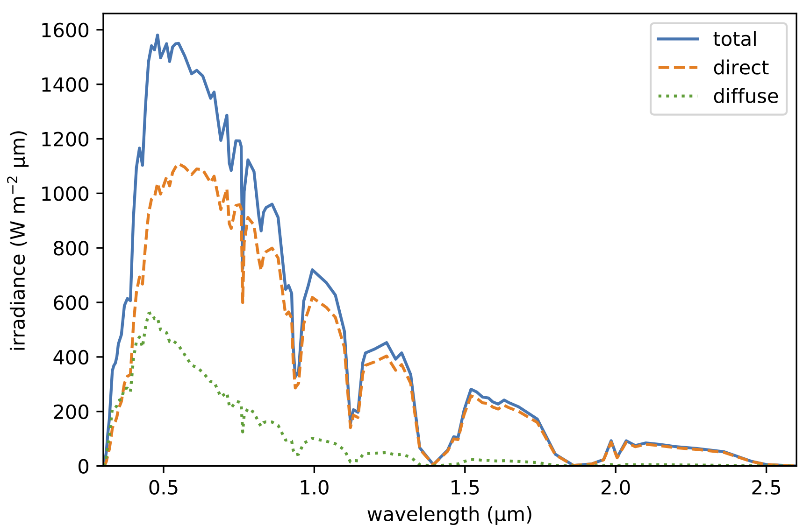
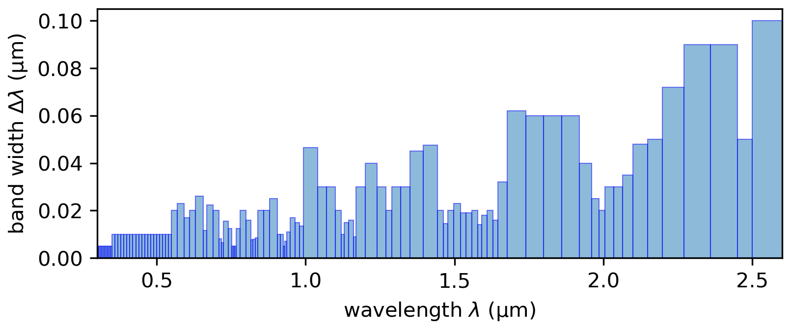

# pyspctral2

Basic Python wrapper for functionality of the SPCTRAL2 atmospheric radiative transfer C code.

This is a single-file Python module, but the presence of the C_code in the expected place is required.

* Current version is a naive approach, requiring compiling the C code for every run.
* Future version will include a Cython-based interface
* or/and the code rewritten in Python

## SPCTRAL2

The Bird Simple Spectral Model v2 ([SPCTRAL2](http://rredc.nrel.gov/solar/models/spectral/))
is a simple atmospheric radiative transfer model that predicts spectral irradiance at the surface.

* 122 bands, in region 0.3&ndash;4.0 &mu;m, with higher spectral resolution in UV and Vis
* Predicts diffuse light and direct solar beam
* Processes modeled using semi-empirical exponential extinction:
  * Ozone absorption
  * Water vapor absorption and scattering
  * Aerosol absorption
  * Refraction

Default spectra (taken from the Excel version, all default settings):

### Inputs

These inputs control the solution that SPCTRAL2 returns.

Essential
* Location (lat, lon)
* Date, time, UTC offset
* total column ozone
  - If not known, SPCTRAL2 will internally estimate total column ozone using a parameterization by location of       date/time.
* total column precipitable water
* aerosol optical depth at 500 nm
* Angle (tilt and aspect) of hypothetical flat collector

## TODO

* [ ] ...
